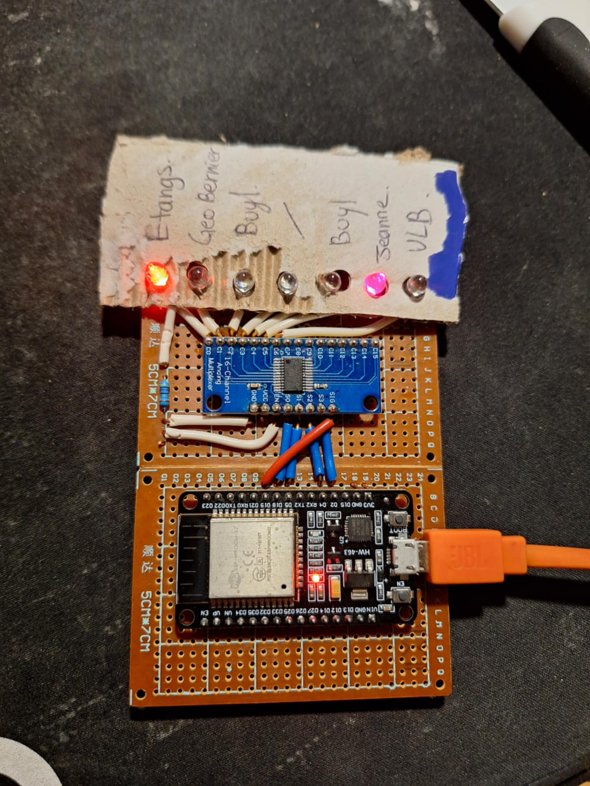

# Brussels transport lines Diplay



## What you need
- ESP32 devkit (we used esp32 WROOM devkit1)
- 16 channel MUX (for maximum 16 LEDs)
- basic electronic componenents (leds, resistor, test board or PCB...)  


(Not yet ready !)
For a complete list of electronic components and the references we used, refer to [hardware section](./hardware/).   
In the same section, the PCB kicad files can be downloaded and you can order them through any PCB manufacturer. 

## Getting started with the STIB API
- Create an account on https://data.stib-mivb.brussels/pages/home/
- Generate API key on https://data.stib-mivb.brussels/account/api-keys/
- Test the api with [request.py](./pc-test/request.py)
    - Change the ****  in the request header with the generated API key
    - Running `python request.py` will show buses location on line 71, you will want to adapt stop IDs to the line you are interested in. You can get all stop IDs for all lines using the WEB API for stops information:  [stops-by-line-production](https://data.stib-mivb.brussels/explore/dataset/stops-by-line-production/api/)

## Getting started on ESP 32
The following steps and requirements are provided for Windows.
- Download the latest micropython firmware for esp32 here : [micropython firmware](https://micropython.org/download/ESP32_GENERIC/)
- Download useful python tools: 
    - `pip install esptool`
    - `pip install adafruit-ampy`
- Erase flash of ESP: `python -m esptool --chip esp32 erase_flash`
- Flash ESP with micropython firmware: `python -m esptool --chip esp32 --port COM3 write_flash -z 0x1000 ESP32_GENERIC-20241129-v1.24.1.bin`
- Adpat **** in main.py with your API key and Wifi credentials
- Send main.py to the ESP to be executed automatically: `<path\to\ampy.exe> --port COMX put <path\to\main.py>`
- Get buses position through serial communication (using Putty per example)
```
LED 3 activée
Bus à: 3559 - ULB vers Jeanne 3559
LED 5 activée
Bus à: 2397 - Buyl(delta) vers ULB 2397
LED 3 activée
Bus à: 3525 - Jeanne vers Buyl 3525
LED 4 activée
```

Like us, you might need to: 
- Download the CP210x driver for ESP USB to UART bridge: [download CP210x](https://www.silabs.com/developer-tools/usb-to-uart-bridge-vcp-drivers?tab=downloads)
- Change the baudrate for the discovered device in device manager to **115200**
- Don't forget to close putty before writing to it

Get more detailed steps: https://docs.micropython.org/en/latest/esp32/tutorial/intro.html  

## Make it ! 
Instructions, schematics and PCBs layout can be found under [hardware section](./hardware/). 

And in the code you will have to adapt the list of stops you want to see with the stop IDs available on STIB web API. Also you will have to change the channel number of each led that has to turn on in the dictionnary with bus stops. (currently only one MUX). 


## CC License 
All work in this project is openly licensed via [CC BY-NC 4.0](https://creativecommons.org/licenses/by-nc/4.0/).
