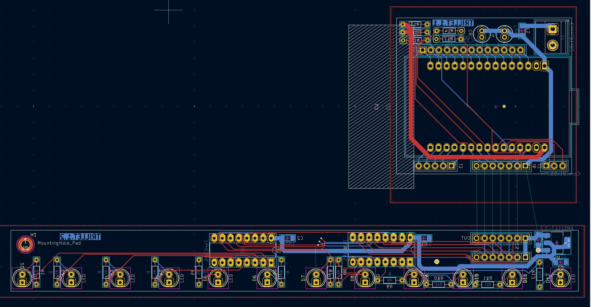
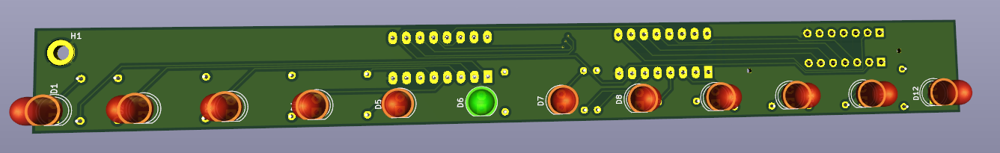

# PCB layout
Helpful ressources for kicad V8,: [Kicad 8 - Getting Started](https://docs.kicad.org/8.0/en/getting_started_in_kicad/getting_started_in_kicad.html)

PCB can easily be manufactured at any PCB manufacturer. I ordered mine at JCLPCB by uploading the gerber and drill files for each board.   
I had to regenerate those with one board only at a time (deleting the rest on the pcb layout). 

The idea is to solder the LED boards in serie, one per line wanted in the final design: 
- J6 Pins of the ESP32 board (Trillet 1.1) go to IN pin of first LED board (Trillet 1.2)
- Pins OUT of the first LED board go to IN pin of the next LED board
## BOM 
### LED board
|Amount|Component|Ref number|
|-|-|-|
| 1 | 3.3v linear voltage regulator | [AMS1117-3.3V](https://www.alldatasheet.com/datasheet-pdf/pdf/205691/ADMOS/AMS1117-3.3.html) |
| 2 | 100nF SMD Capacitor | 100nF 1206 SMD:C |
| 2 | 22uF SMD Capacitor | 22uF 1206 SMD:C |
| 2 | 8bit shift register | [SN74HC595N (THT) ](https://www.alldatasheet.fr/datasheet-pdf/download/27939/TI/SN74HC595N.html) |
| 12 | LED THT | 5mm THT LED|
| 12 | Resistor THT (see value below)| DIN 0204 R THT 3.6 mm |
| 1 | 7  pin JST connector (female + male + cable) | [2.54 mm JST male/ + female](https://fr.aliexpress.com/item/32964549472.html)  |

### ESP 32 - Power board
|Amount|Component|Ref number|
|-|-|-|
| 1 | Terminal copnnector block 5mm - 2Pin | [ZR301-2P-Green-50](https://fr.aliexpress.com/item/1005007055503766.html) |
| 5 | 10 k Ohm  Resistor | 10k Ohm - DIN 0204 R THT 3.6 mm|
| 1 | 3.5 A SMD fuse | [3.5A 1206 SMD:Fuse](https://fr.aliexpress.com/item/32901034711.html) |
| 2 | ESP 32 Wroom-32 Nodemcu type C | [esp32 devkit  (check pinout!)](https://fr.aliexpress.com/item/1005006478818552.html) |
| 1 | 100nF THT polarized electrolitic capacitor | 5mm THT:C |
| 1 | 100uF THT polarized electrolitic capacitor | 5mm THT:C |
| 1 | 7  pin JST connector (female + male + cable) | [2.54 mm JST male/ + female](https://fr.aliexpress.com/item/32964549472.html)  |

## LED to Resitor value

TODO
